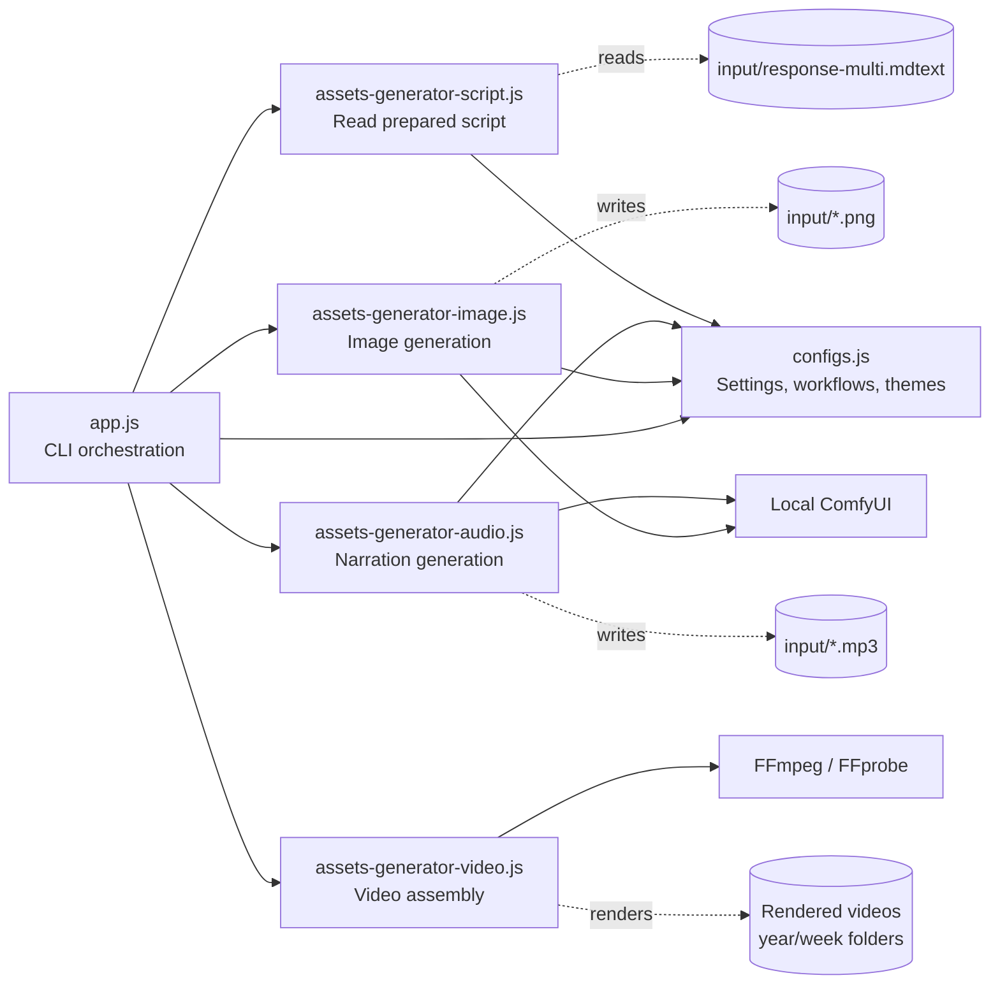
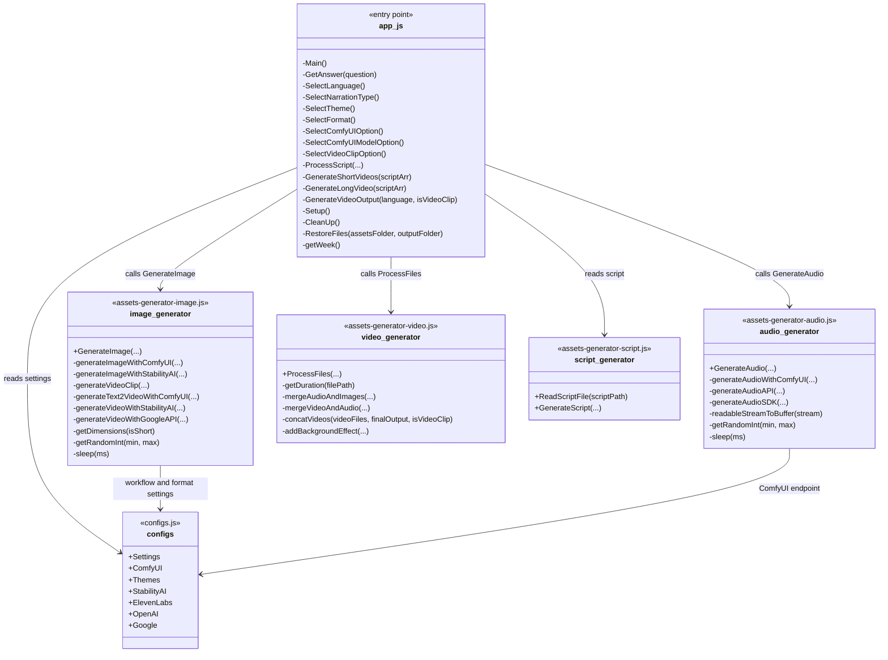
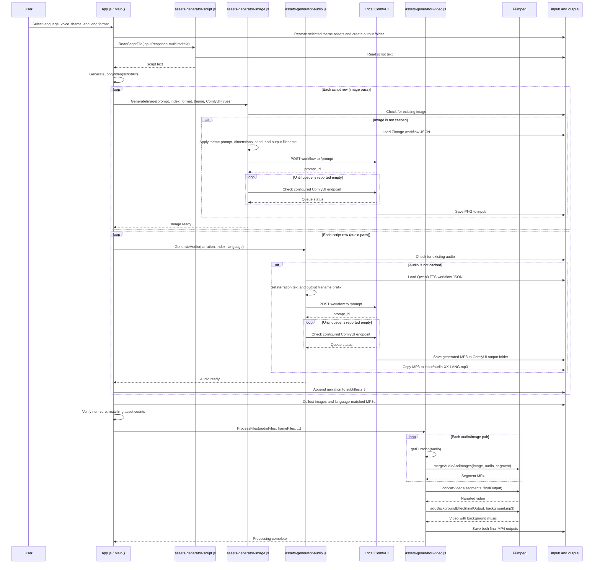

# StorytellingAI

StorytellingAI is a Node.js command-line application for turning a prepared, table-formatted script into narrated videos. It supports English or Spanish narration, long-form or vertical Shorts formats, and configurable themes. In the documented happy path, local ComfyUI workflows generate still images and Qwen3 TTS narration; FFmpeg then assembles the assets into video files.

The script is read from `input/response-multi.mdtext`. Each content row supplies an image prompt and narration text. Generated assets are stored in `input/`, and rendered videos are organized under `output/<year>/<week>/`.

## Architecture

## Modules and functions

The modules below are CommonJS files. `app.js` is the executable entry point; its functions are internal and are not exported. The generator modules expose the public functions listed below. Other listed functions are internal helpers.

`+` marks exported functions or values; `-` marks internal implementation functions (not JavaScript `#private` members). The functions in `app.js` are internal. `GenerateScript()` is deprecated, and `generateAudioAPI()` / `generateAudioSDK()` are inactive alternate paths.

### Module responsibilities

| Module | Responsibility | Public API |
| --- | --- | --- |
| `app.js` | Prompts for generation options, reads and processes script rows, manages assets, and starts rendering. | Executable entry point; no exported API. |
| `assets-generator-script.js` | Reads the prepared script. Also contains the deprecated script-generation path. | `ReadScriptFile()`, `GenerateScript()` (deprecated). |
| `assets-generator-image.js` | Generates and caches image assets; also contains optional video-clip and alternate-provider helpers. | `GenerateImage()`. |
| `assets-generator-audio.js` | Generates and caches narration audio. The active dispatcher uses ComfyUI. | `GenerateAudio()`. |
| `assets-generator-video.js` | Pairs audio with still images or clips, joins segments, and creates a background-music version. | `ProcessFiles()`. |
| `configs.js` | Exposes theme prompts/assets, ComfyUI workflow paths and dimensions, and other provider settings. | `configs` object. |

## ComfyUI generation sequence (happy path)

This sequence documents long-form video generation with still images and ComfyUI Qwen3 TTS. It omits the inactive ElevenLabs and other alternate-generator paths. Existing assets are reused when their expected files are already present.

For Shorts, `GenerateShortVideos()` instead processes rows in batches of `Settings.ShortIncrement` (currently 4) and assembles a separate output for each batch.

### ComfyUI runtime assumptions

- The configured ComfyUI URL is `http://127.0.0.1:8188/prompt`.
- Image and audio generation poll that configured URL for `exec_info.queue_remaining`; the local ComfyUI setup must provide the response shape expected by the code.
- The Qwen3 TTS workflow saves audio under the `AUDIOTEMP/` prefix. `generateAudioWithComfyUI()` currently copies the result from a hard-coded Windows ComfyUI output directory in `assets-generator-audio.js`; update that path if your ComfyUI output directory differs.

## Objectives

- [x] Multi-theme support for videos with different topics (Horror, programming, etc)
- [x] Integration with ComfyUI custom workflows
- [x] Integration with LLM-enhanced image generation flow (ComfyUI)
- [x] Replace Axios calls with ElevenLabs npm package
- [x] Integration with Vertex AI video generation